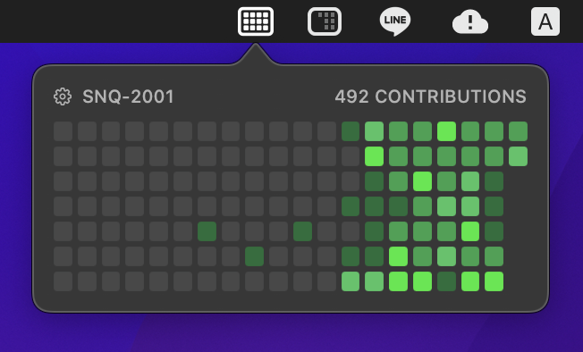

This project was created in reference to the [GitHub Contribution Graphs for iOS](https://github.com/SNQ-2001/github-contributions-ios) project.

# GitHub Contribution Graphs for macOS

Quickly check in on your GitHub contributions from your Menu Bar!

- Type your GitHub username
- Choose between different color themes

## Screenshots

## Requirements

- macOS 13.0+
- Xcode 14.1+

## Contributing

If you have feature requests or bug reports, feel free to help out by sending pull requests or by [creating new issues](https://github.com/SNQ-2001/github-contributions-menubar-macos/issues/new).

## Credits

"GitHub Contribution Graphs for macOS" is brought to you by [SNQ-2001](https://github.com/SNQ-2001) and [contributors to the project](https://github.com/SNQ-2001/github-contributions-menubar-macos/contributors).

### Third-Party Libraries

- [SwiftSoup](https://github.com/scinfu/SwiftSoup) by [@scinfu](https://github.com/scinfu)
- [SkeletonUI](https://github.com/CSolanaM/SkeletonUI) by [CSolanaM](https://github.com/CSolanaM)
- [SnapshotTesting](https://github.com/pointfreeco/swift-snapshot-testing) by [pointfreeco](https://github.com/pointfreeco)
- [LicensePlist](https://github.com/mono0926/LicensePlist) by [mono0926](https://github.com/mono0926)
- [SwiftGen](https://github.com/SwiftGen/SwiftGen) by [SwiftGen](https://github.com/SwiftGen)
- [SwiftLint](https://github.com/realm/SwiftLint) by [realm](https://github.com/realm)

## License

"GitHub Contribution Graphs for macOS" is released under the MIT license. See [LICENSE](LICENSE) for details.

